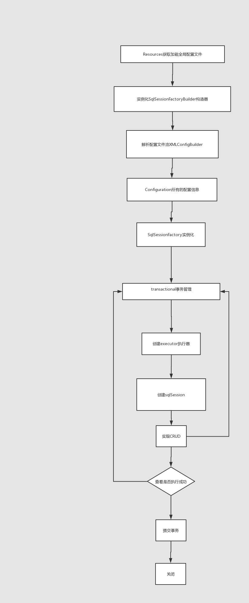
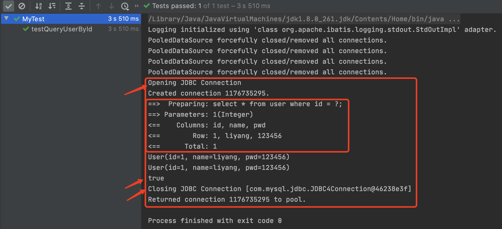
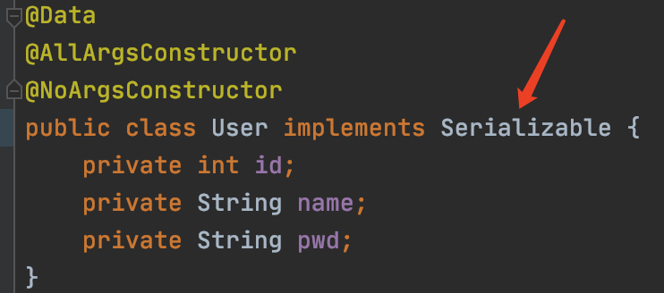
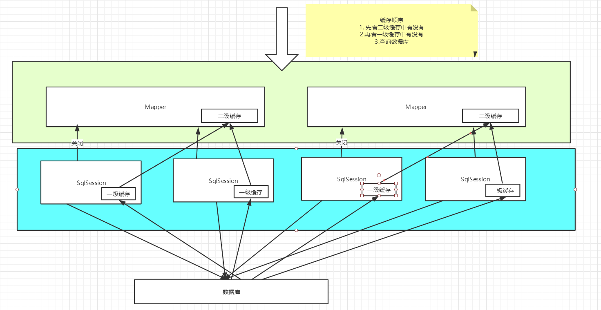

# MyBatis

【2020-10.07】

环境：

*   JDK 1.8
*   Mysql 5.7 或 8.0 （这里使用8.0.21）
*   maven 3.6.3 （不要使用3.6.2）
*   idea

回顾：

*   JDBC
*   Mysql
*   Java基础
*   Maven
*   Junit

**SSM框架：配置文件，看官方文档，mybatis有中文文档**


## 1 简介

### 1.1 什么是 MyBatis ？

*   MyBatis 是一款优秀的**持久层框架**。
*   它支持自定义 SQL、存储过程以及高级映射。
*   MyBatis 免除了几乎所有的 JDBC 代码以及设置参数和获取结果集的工作。
*   MyBatis 可以通过简单的 XML 或注解来配置和映射原始类型、接口和 Java POJO（Plain Old Java Objects，普通老式 Java 对象）为数据库中的记录。
*   MyBatis 本是[apache](https://baike.baidu.com/item/apache/6265)的一个开源项目[iBatis](https://baike.baidu.com/item/iBatis), 2010年这个项目由apache software foundation 迁移到了google code，并且改名为MyBatis 。
*   2013年11月迁移到Github。


如何获取Mybatis？

*   maven仓库

```xml
<!-- https://mvnrepository.com/artifact/org.mybatis/mybatis -->
<dependency>
    <groupId>org.mybatis</groupId>
    <artifactId>mybatis</artifactId>
    <version>3.5.6</version>
</dependency>
```

*   github：https://github.com/mybatis/mybatis-3/releases/tag/mybatis-3.5.6
*   中文文档：https://mybatis.org/mybatis-3/zh/index.html


### 1.2 持久层

数据持久化

*   就是将程序的数据在内存的瞬时状态转化为持久状态的过程，主要存储在数据库中。
*   数据库（jdbc），io文件持久化。


为什么需要持久化 ？

*   有一些对象，不能让他丢掉

*   内存太贵


### 1.3 持久层

Dao层、Service层、Controller层...

*   完成持久化工作的代码块
*   层界限十分明显


### 1.4 为什么需要MyBatis ？

*   帮助程序员将数据存入数据库中
*   方便，框架，自动
*   传统的JDBC代码太复杂了，简化。
*   不用MyBatis也可以，更容易上手，**技术没有高低之分**

优点：

*   简单易学：本身就很小且简单。没有任何第三方依赖，最简单安装只要两个jar文件+配置几个sql映射文件易于学习，易于使用，通过文档和源代码，可以比较完全的掌握它的设计思路和实现。
*   灵活：mybatis不会对应用程序或者数据库的现有设计强加任何影响。 sql写在xml里，便于统一管理和优化。通过sql语句可以满足操作数据库的所有需求。
*   解除sql与程序代码的耦合：通过提供DAO层，将业务逻辑和数据访问逻辑分离，使系统的设计更清晰，更易维护，更易单元测试。sql和代码的分离，提高了可维护性。
*   提供映射标签，支持对象与数据库的orm字段关系映射
*   提供对象关系映射标签，支持对象关系组建维护
*   提供xml标签，支持编写动态sql。


**最重要的一点：使用的人多！**

Spring、SpringMVC、SpringBoot


## 2 第一个Mybatis程序

思路：搭建环境 - 导入Mybatis - 编写代码 - 测试

### 2.1 搭建环境

搭建数据库

```sql
首先登陆：mysql -u root -p
输入密码：xxx
创建一个数据库： create database mybatis;
查看数据库： show databases;
使用数据库： use mybatis;
创建一个表： create table user(id int(20) not null primary key, name varchar(30) default null, pwd varchar(30) default null)engine=innodb default charset=utf8;
查看表：show tables;
查看表的列属性： show columns from user;
插入数据： insert into user(id, name, pwd) values(1, 'liyang', '123456'),(2, '张三', '123456'),(3, '李四', '123456');
查看表的内容：select * from user;
```

新建项目

1、新建一个普通的maven项目

2、删除src目录

3、导入maven依赖

*   mysql驱动

```xml
<!--mysql驱动-->
<dependency>
    <groupId>mysql</groupId>
    <artifactId>mysql-connector-java</artifactId>
    <version>5.1.49</version>
</dependency>
```

*   mybatis

```xml
<!-- 模版 -->
<dependency>
  <groupId>org.mybatis</groupId>
  <artifactId>mybatis</artifactId>
  <version>x.x.x</version>
</dependency>

<!-- https://mvnrepository.com/artifact/org.mybatis/mybatis -->
<dependency>
    <groupId>org.mybatis</groupId>
    <artifactId>mybatis</artifactId>
    <version>3.5.6</version>
</dependency>
```

*   junit

```xml
<dependency>
    <groupId>junit</groupId>
    <artifactId>junit</artifactId>
    <version>4.12</version>
    <scope>test</scope>
</dependency>
```


###  2.2 创建一个模块

*   编写mybatis的核心配置文件

```xml
<?xml version="1.0" encoding="UTF-8" ?>
<!DOCTYPE configuration
        PUBLIC "-//mybatis.org//DTD Config 3.0//EN"
        "http://mybatis.org/dtd/mybatis-3-config.dtd">
<!--configuration核心配置文件-->
<configuration>
    <environments default="development">
        <environment id="development">
            <transactionManager type="JDBC"/>
            <dataSource type="POOLED">
                <property name="driver" value="com.mysql.jdbc.Driver"/>
                <property name="url" value="jdbc:mysql://localhost:3306/mybatis?useSSL=true&amp;useUnicode=true&amp;characterEncoding=UTF-8"/>
                <property name="username" value="root"/>
                <property name="password" value="12345678"/>
            </dataSource>
        </environment>
    </environments>


<!--    -->
<!--    <mappers>-->
<!--        <mapper resource="org/mybatis/example/BlogMapper.xml"/>-->
<!--    </mappers>-->

</configuration>
```


*   编写mybatis的工具类

```java
package com.ly.utils;

import org.apache.ibatis.io.Resources;
import org.apache.ibatis.session.SqlSession;
import org.apache.ibatis.session.SqlSessionFactory;
import org.apache.ibatis.session.SqlSessionFactoryBuilder;

import java.io.IOException;
import java.io.InputStream;


/**
 * liyang 2020-10-08
 *
 * 工具类：建造SqlSessionFactory对象，从工厂中获取SqlSession
 */
public class MybatisUtils {

    private static SqlSessionFactory sqlSessionFactory;

    static {
        String resource = "mybatis-config.xml";
        InputStream inputStream = null;
        try {
            inputStream = Resources.getResourceAsStream(resource);
        } catch (IOException e) {
            e.printStackTrace();
        }
        sqlSessionFactory = new SqlSessionFactoryBuilder().build(inputStream);
    }

    /**
     * 既然有了 SqlSessionFactory，顾名思义，我们可以从中获得 SqlSession 的实例。
     * SqlSession 提供了在数据库执行 SQL 命令所需的所有方法。
     * 你可以通过 SqlSession 实例来直接执行已映射的 SQL 语句。
     */
    public static SqlSession getSqlSession() {
        return sqlSessionFactory.openSession();
    }

}
```


### 2.3 编写代码

*   实体类

```java
package com.ly.pojo;

/**
 * 对应数据库表的实体类
 */
public class User {
    private int id;
    private String name;
    private String pwd;

    public User() {
    }

    public User(int id, String name, String pwd) {
        this.id = id;
        this.name = name;
        this.pwd = pwd;
    }

    public int getId() {
        return id;
    }

    public void setId(int id) {
        this.id = id;
    }

    public String getName() {
        return name;
    }

    public void setName(String name) {
        this.name = name;
    }

    public String getPwd() {
        return pwd;
    }

    public void setPwd(String pwd) {
        this.pwd = pwd;
    }

    @Override
    public String toString() {
        return "User{" +
                "id=" + id +
                ", name='" + name + '\'' +
                ", pwd='" + pwd + '\'' +
                '}';
    }
}
```


*   Dao接口

```java
package com.ly.dao;

import com.ly.pojo.User;

import java.util.List;

/**
 * UserDao等价于Mybatis中的Mapper
 * 以后的操作中都使用Mapper
 */
public interface UserDao {
    List<User> getUserList();

}
```


*   DaoImpl实现类【**这是使用jdbc的传统做法，我们这里使用MyBatis就不用创建这个实现类，通过xml文件来配置**】

```java
package com.ly.dao;

import com.ly.pojo.User;

import java.util.List;

/**
 * jdbc的处理方式
 */
public class UserDaoImpl implements UserDao {
    public List<User> getUserList() {
        return null;
    }
}
```

**使用MyBatis通过xml文件来配置替代DaoImpl**

```xml
<?xml version="1.0" encoding="UTF-8" ?>
<!DOCTYPE mapper
        PUBLIC "-//mybatis.org//DTD Mapper 3.0//EN"
        "http://mybatis.org/dtd/mybatis-3-mapper.dtd">
<!--namespace=绑定一个对应的Dao/Mapper接口-->
<mapper namespace="com.ly.dao.UserMapper">

    <!--查询语句-->
    <select id="getUserList" resultType="com.ly.pojo.User">
        select * from mybatis.user
    </select>
</mapper>
```


### 2.4 测试

注意点：

org.apache.ibatis.binding.BindingException: Type interface com.ly.dao.UserMapper is not known to the MapperRegistry.

**MapperRegistry是什么？**


org.apache.ibatis.binding.BindingException: Type interface com.ly.dao.UserMapper is not known to the MapperRegistry.


The error may exist in com/ly/dao/UserMapper.xml

Cause: org.apache.ibatis.builder.BuilderException: Error parsing SQL Mapper Configuration. Cause: java.io.IOException: Could not find resource com/ly/dao/UserMapper.xml

Caused by: java.io.IOException: Could not find resource com/ly/dao/UserMapper.xml


```xml
<!--在build中配置resource，来放置我们资源导出失败问题-->
<build>
    <resources>
        <resource>
            <directory>src/main/java</directory>
            <includes>
                <include>**/*.properties</include>
                <include>**/*.xml</include>
            </includes>
            <filtering>false</filtering>
        </resource>
        <resource>
            <directory>src/main/resources</directory>
            <includes>
                <include>**/*.properties</include>
                <include>**/*.xml</include>
            </includes>
            <filtering>false</filtering>
        </resource>
    </resources>
</build>
```

能出现问题说明：Maven静态资源过滤问题

```xml
<resources>
   <resource>
       <directory>src/main/java</directory>
       <includes>
           <include>**/*.properties</include>
           <include>**/*.xml</include>
       </includes>
       <filtering>false</filtering>
   </resource>
   <resource>
       <directory>src/main/resources</directory>
       <includes>
           <include>**/*.properties</include>
           <include>**/*.xml</include>
       </includes>
       <filtering>false</filtering>
   </resource>
</resources>
```


java.lang.NoClassDefFoundError: com/ly/pojo/user (wrong name: com/ly/pojo/User)


org.apache.ibatis.exceptions.PersistenceException: 

Error querying database.  Cause: com.mysql.jdbc.exceptions.jdbc4.CommunicationsException: Communications link failure

```xml
useSSL=true   写true 会报错，我改成false 就可以了。

2019-11-21 15:2542回复

大菠萝很优秀MySQL在高版本需要指明是否进行SSL连接
SSL协议提供服务主要： 		
       1）认证用户服务器，确保数据发送到正确的服务器； 　　 .
       2）加密数据，防止数据传输途中被窃取使用；
       3）维护数据完整性，验证数据在传输过程中是否丢失；
2020-05-28 23:336回复

大菠萝很优秀回复 @大菠萝很优秀 :Establishing SSL connection without server's identity verification is not recommended. According to MySQL 5.5.45+, 5.6.26+ and 5.7.6+ requirements SSL connection must be established by default if explicit option isn't set. For compliance with existing applications not using SSL the verifyServerCertificate property is set to 'false'. You need either to explicitly disable SSL by setting useSSL=false, or set useSSL=true and provide truststore for server certificate verification

不建议在没有服务器身份验证的情况下建立SSL连接。根据MySQL 5.5.45+、5.6.26+和5.7.6+的要求，如果不设置显式选项，则必须建立默认的SSL连接。您需要通过设置useSSL=false显式地禁用SSL，或者设置useSSL=true并为服务器证书验证提供信任存储

解决方法：
2020-05-28 23:384回复

大菠萝很优秀回复 @大菠萝很优秀 :JDBC在与数据库连接时，JDBC与MySQL版本不兼容，MySQL的版本高一些
2020-05-28 23:353回复
```


*   junit测试

测试的问题搞定了！

一个是mapper的配置问题！

一个是pom.xml配置的过滤问题！

```java
package com.ly.dao;

import com.ly.pojo.User;
import com.ly.com.ly.utils.MybatisUtils;
import org.apache.ibatis.session.SqlSession;
import org.junit.Test;

import java.util.List;

/**
 * liyang 2020-10-08
 * 测试封装好的MybatisUtils生成sqlSession，然后进行数据库操作
 */
public class UserDaoTest {

    @Test
    public void test() {
        // 获得SqlSession对象
        SqlSession sqlSession = MybatisUtils.getSqlSession();

        // 方法1：getMapper然后执行sql，官方推荐
        UserDao mapper = sqlSession.getMapper(UserDao.class);
        List<User> userList = mapper.getUserList();

//        // 方法2：已经过时，不推荐
//        List<User> userList = sqlSession.selectList("com.ly.dao.UserMapper.getUserList");
        
        for (User user : userList) {
            System.out.println(user);
        }

        // 关闭SqlSession
        sqlSession.close();
    }
}
```


鉴于需要确保每次sqlSession的close操作都被执行


于是改造代码如下所示：

```java
public class UserDaoTest {

    @Test
    public void test() {
        // 获得SqlSession对象
        SqlSession sqlSession = MybatisUtils.getSqlSession();
        try {
            UserDao mapper = sqlSession.getMapper(UserDao.class);
            List<User> userList = mapper.getUserList();
            for (User user : userList) {
                System.out.println(user);
            }
        } finally {
            sqlSession.close();
        }
    }
}
```


## 3 CRUD

将UserDao及其相关配置名改为UserMapper


### 3.1 namespace

namespace中的包名要和Dao/Mapper接口的包名一致


resouce：路径是分割是'/'

其他位置的限定：全链路名，分割是'.'


只有select会自动提交，insert、update、delete并不会自动提交，所以需要手动提交，后面的操作关注三个箭头指向的类即可。


### 3.2 getUserById

```java
// 查询一个用户
User getUserById(int id);
```

```xml
<select id="getUserById" parameterType="int" resultType="com.ly.pojo.User">
    select * from mybatis.user where id = #{id};
</select>
```

```java
@Test
public void testGetUserById() {
    // 获得SqlSession对象
    SqlSession sqlSession = MybatisUtils.getSqlSession();
    try {
        UserMapper mapper = sqlSession.getMapper(UserMapper.class);
        User user = mapper.getUserById(1);
        System.out.println(user);
    } finally {
        sqlSession.close();
    }
}
```


### 3.3 addUser

```java
// 查询一个用户
User getUserById(int id);
```

```xml
<insert id="addUser" parameterType="com.ly.pojo.User">
    insert into mybatis.user (id, name, pwd) values (#{id}, #{name}, #{pwd});
</insert>
```

```java
@Test
public void testAddUser() {
    // 获得SqlSession对象
    SqlSession sqlSession = MybatisUtils.getSqlSession();
    try {
        UserMapper mapper = sqlSession.getMapper(UserMapper.class);
        int res = mapper.addUser(new User(4, "王五", "12345678"));

        if (res > 0) {
            System.out.println("插入成功");
            sqlSession.commit();
        }
        System.out.println(res);
    } finally {
        sqlSession.close();
    }
}
```


### 3.4 updateUser

```java
// 修改一个用户
int updateUser(User user);
```

```xml
<update id="updateUser" parameterType="com.ly.pojo.User">
    update mybatis.user set name = #{name}, pwd = #{pwd} where id = #{id};
</update>
```

```java
@Test
public void testUpdateUser() {
    // 获得SqlSession对象
    SqlSession sqlSession = MybatisUtils.getSqlSession();
    try {
        UserMapper mapper = sqlSession.getMapper(UserMapper.class);
        int res = mapper.updateUser(new User(4, "Alice", "123456"));
        if (res > 0) {
            System.out.println("更新成功");
            sqlSession.commit();
        }
        System.out.println(res);
    } finally {
        sqlSession.close();
    }
}
```


### 3.5 deleteUser

```java
// 删除一个用户
int deleteUser(int id);
```

```xml
<delete id="deleteUser" parameterType="int">
    delete from mybatis.user where id = #{id};
</delete>
```

```java
@Test
public void testDeleteUser() {
    // 获得SqlSession对象
    SqlSession sqlSession = MybatisUtils.getSqlSession();
    try {
        UserMapper mapper = sqlSession.getMapper(UserMapper.class);
        int res = mapper.deleteUser(4);
        if (res > 0) {
            System.out.println("删除成功");
            sqlSession.commit();
        }
        System.out.println(res); // 成功返回1
    } finally {
        sqlSession.close();
    }
}
```


[带有catch异常的mybatis的crud](https://blog.csdn.net/qq_44679744/article/details/101052428)

**【以上，crud操作可能会报异常，所以最好catch一下异常，后续添加】**


### 3.6 Mybatis和JDBC的区别

[JDBC数据增删改过程](https://blog.csdn.net/u010176014/article/details/52028854?utm_medium=distribute.pc_relevant_t0.none-task-blog-BlogCommendFromMachineLearnPai2-1.channel_param&depth_1-utm_source=distribute.pc_relevant_t0.none-task-blog-BlogCommendFromMachineLearnPai2-1.channel_param)

JDBC是Java提供的一个**操作数据库的API**； MyBatis是一个持久层ORM框架，**底层是对JDBC的封装**。
MyBatis对JDBC操作数据库做了一系列的优化：
（1） mybatis使用已有的连接池管理，避免浪费资源，提高程序可靠性。
（2） mybatis提供插件自动生成DAO层代码，提高编码效率和准确性。
（3） mybatis 提供了一级和二级缓存，提高了程序性能。
（4） mybatis使用动态SQL语句，提高了SQL维护。（此优势是基于XML配置）
（5） mybatis对数据库操作结果进行自动映射


```java
catch (Exception e) {
    System.out.println("addUser插入失败");
    e.printStackTrace();
}
```


```java
java.lang.ExceptionInInitializerError
### Error building SqlSession.
### The error may exist in com/lhj/mapper/PersonMapper.xml
### Cause: org.apache.ibatis.builder.BuilderException: ......
```

这个时候虽然在pom.xml文件中配置了，但需要重新刷新一下（**generate sources and update folders for all projects**）


[Java DAO 模式](https://www.runoob.com/note/27029)


&serverTimezone=UTC

Cause: com.mysql.jdbc.exceptions.jdbc4.MySQLNonTransientConnectionException: Public Key Retrieval is not allowed


## 4 配置解析


### 4.4 类型别名（typeAliases）

**方式1**: 类型别名可为 Java 类型设置一个缩写名字。 它仅用于 XML 配置，意在降低冗余的全限定类名书写。例如：

```xml
<!--取别名，方式1-->
<typeAliases>
    <typeAlias alias="User" type="com.ly.pojo.User"/>
</typeAliases>
```

当这样配置时，`User` 可以用在任何使用 `com.ly.pojo.User` 的地方。

**方式2**: 也可以指定一个包名，MyBatis 会在包名下面搜索需要的 Java Bean，比如：

```xml
<typeAliases>
  <package name="com.ly.pojo"/>
</typeAliases>
```

每一个在包 `com.ly.pojo` 中的 Java Bean，在没有注解的情况下，会使用 Bean 的首字母小写的非限定类名来作为它的别名。 比如 `com.ly.pojo.User` 的别名为 `user`；若有注解，则别名为其注解值。见下面的例子：

```java
@Alias("User")
public class User {
    ...
}
```

**经过测试，在使用的时候，默认情况下，使用User还是可以正常运行，充分测试后，发现大小写不敏感，不过建议还是规范化！**


### 4.5 设置（settings）

这是 MyBatis 中极为重要的调整设置，它们会改变 MyBatis 的运行时行为。 设置项较多，着重记住以下三个！


### 4.6 其他配置

- [typeHandlers（类型处理器）](https://mybatis.org/mybatis-3/zh/configuration.html#typeHandlers)
- [objectFactory（对象工厂）](https://mybatis.org/mybatis-3/zh/configuration.html#objectFactory)
- [plugins（插件）](https://mybatis.org/mybatis-3/zh/configuration.html#plugins)
    - mybatis-generator-core
    - mybatis-plus
    - 通用mapper


### 4.7 映射器（mappers）

MapperRegistry：注册绑定我们的Mapper文件

既然 MyBatis 的行为已经由上述元素配置完了，我们现在就要来定义 SQL 映射语句了。 但首先，我们需要告诉 MyBatis 到哪里去找到这些语句。 在自动查找资源方面，Java 并没有提供一个很好的解决方案，所以最好的办法是直接告诉 MyBatis 到哪里去找映射文件。 你可以使用相对于类路径的资源引用，或完全限定资源定位符（包括 `file:///` 形式的 URL），或类名和包名等。

官网介绍了四种方式，我们这里主要使用两种方式，并给出最推荐的使用方式！

**方式1： 【推荐使用，文件位置可以随便放】**

```xml
<!--每一个Mapper.XML都需要在Mybatis核心配置文件中注册！-->
<mappers>
    <mapper resource="com/ly/dao/UserMapper.xml"/>
</mappers>
```


**方式2：使用class文件绑定注册【需要注意文件名和文件位置】**

```xml
<!--每一个Mapper.XML都需要在Mybatis核心配置文件中注册！-->
<mappers>
    <mapper class="com.ly.dao.UserMapper"/>
</mappers>
```

方式2注意点：

- 接口和他的Mapper配置文件必须同名！
- 接口和他的Mapper配置文件必须在同一个包下！


**方式3：使用扫描包进行注入绑定【需要注意文件名和文件位置】**

```xml
<!--每一个Mapper.XML都需要在Mybatis核心配置文件中注册！-->
<mappers>
    <package name="com.ly.dao"/>
</mappers>
```

方式3注意点：

- 接口和他的Mapper配置文件必须同名！
- 接口和他的Mapper配置文件必须在同一个包下！


**方式4：使用完全限定资源定位符（URL）【不使用】**

```xml
<!-- 使用完全限定资源定位符（URL） -->
<mappers>
  <mapper url="file:///var/mappers/AuthorMapper.xml"/>
  <mapper url="file:///var/mappers/BlogMapper.xml"/>
  <mapper url="file:///var/mappers/PostMapper.xml"/>
</mappers
```


### 4.8 作用域（Scope）和生命周期

生命周期，和作用域，是至关重要的，因为错误的使用会导致非常严重的**并发问题**。


**SqlSessionFactoryBuilder：**

- 一旦创建了 SqlSessionFactory，就不再需要它了
- 局部变量

**SqlSessionFactory：**

- 说白了就是可以想象为 ：数据库连接池
- SqlSessionFactory 一旦被创建就应该在应用的运行期间一直存在，**没有任何理由丢弃它或重新创建另一个实例。** 
- 因此 SqlSessionFactory 的最佳作用域是应用作用域。 
- 最简单的就是使用**单例模式**或者静态单例模式。

**SqlSession**

- 连接到连接池的一个请求！
- SqlSession 的实例不是线程安全的，因此是不能被共享的，所以它的最佳的作用域是请求或方法作用域。
- 用完之后需要赶紧关闭，否则资源被占用！


*这里面的每一个Mapper，就代表一个具体的业务！*


**【以下官网解释】**

理解我们之前讨论过的不同作用域和生命周期类别是至关重要的，因为错误的使用会导致非常严重的并发问题。

---

**提示** **对象生命周期和依赖注入框架**

依赖注入框架可以创建线程安全的、基于事务的 SqlSession 和映射器，并将它们直接注入到你的 bean 中，因此可以直接忽略它们的生命周期。 如果对如何通过依赖注入框架使用 MyBatis 感兴趣，可以研究一下 MyBatis-Spring 或 MyBatis-Guice 两个子项目。

------

#### SqlSessionFactoryBuilder

这个类可以被实例化、使用和丢弃，一旦创建了 SqlSessionFactory，就不再需要它了。 因此 SqlSessionFactoryBuilder 实例的最佳作用域是方法作用域（也就是局部方法变量）。 你可以重用 SqlSessionFactoryBuilder 来创建多个 SqlSessionFactory 实例，但最好还是不要一直保留着它，以保证所有的 XML 解析资源可以被释放给更重要的事情。

#### SqlSessionFactory

SqlSessionFactory 一旦被创建就应该在应用的运行期间一直存在，没有任何理由丢弃它或重新创建另一个实例。 使用SqlSessionFactory 的最佳实践是在应用运行期间不要重复创建多次，多次重建 SqlSessionFactory 被视为一种代码“坏习惯”。因此 SqlSessionFactory 的最佳作用域是应用作用域。 有很多方法可以做到，最简单的就是使用单例模式或者静态单例模式。

#### SqlSession

每个线程都应该有它自己的 SqlSession 实例。SqlSession 的实例不是线程安全的，因此是不能被共享的，所以它的最佳的作用域是请求或方法作用域。 绝对不能将 SqlSession 实例的引用放在一个类的静态域，甚至一个类的实例变量也不行。 也绝不能将 SqlSession 实例的引用放在任何类型的托管作用域中，比如 Servlet 框架中的 HttpSession。 如果你现在正在使用一种 Web 框架，考虑将 SqlSession 放在一个和 HTTP 请求相似的作用域中。 换句话说，每次收到 HTTP 请求，就可以打开一个 SqlSession，返回一个响应后，就关闭它。 这个关闭操作很重要，为了确保每次都能执行关闭操作，你应该把这个关闭操作放到 finally 块中。 下面的示例就是一个确保 SqlSession 关闭的标准模式：

```java
try (SqlSession session = sqlSessionFactory.openSession()) {
  // 你的应用逻辑代码
}
```

在所有代码中都遵循这种使用模式，可以保证所有数据库资源都能被正确地关闭。

#### 映射器实例

映射器是一些绑定映射语句的接口。映射器接口的实例是从 SqlSession 中获得的。虽然从技术层面上来讲，任何映射器实例的最大作用域与请求它们的 SqlSession 相同。但方法作用域才是映射器实例的最合适的作用域。 也就是说，映射器实例应该在调用它们的方法中被获取，使用完毕之后即可丢弃。 映射器实例并不需要被显式地关闭。尽管在整个请求作用域保留映射器实例不会有什么问题，但是你很快会发现，在这个作用域上管理太多像 SqlSession 的资源会让你忙不过来。 因此，最好将映射器放在方法作用域内。就像下面的例子一样：

```java
try (SqlSession session = sqlSessionFactory.openSession()) {
  BlogMapper mapper = session.getMapper(BlogMapper.class);
  // 你的应用逻辑代码
}
```


**Bug: Try-with-resources are not supported at language level '5'**

File >> Project Structure >> Project language level确实是8

那么需要在pom.xml文件中的build标签进行配置

```xml
<build>
    <plugins>
        <plugin>
            <groupId>org.apache.maven.plugins</groupId>
            <artifactId>maven-compiler-plugin</artifactId>
            <configuration>
                <source>8</source>
                <target>8</target>
            </configuration>
        </plugin>
    </plugins>
</build>
```


**【SQLException】**

```java
try {
    // 实际Connection的获取
    conn = transactionAware ? dataSource.getConnection() : DataSourceUtils.getConnection(dataSource);
} catch (SQLException e) {
    throw new CannotGetJdbcConnectionException("Could not get JDBC Connection for SqlSession", e);
}
```


**【Redundant 'close'】**

```java
// 获得SqlSession对象
// Try-with-resources are not supported at language level '5’错误。
// 在pom.xml的build标签加了使用jdk1.8的配置
try (SqlSession sqlSession = MybatisUtils.getSqlSession()) {
    UserMapper mapper = sqlSession.getMapper(UserMapper.class);
    List<User> userList = mapper.getUserList();
    for (User user : userList) {
        System.out.println(user);
    }
    // First: The try-with-resources statement provides an automatic close at the end of its scope.
    //Second: Flush is redundant before close.
    sqlSession.close(); // Redundant 'close': close is not request, the reason is explained above
}
```


### 4.9 对命名空间的一点补充

在之前版本的 MyBatis 中，**命名空间（Namespaces）**的作用并不大，是可选的。 但现在，随着命名空间越发重要，你必须指定命名空间。

命名空间的作用有两个，一个是利用更长的全限定名来将不同的语句隔离开来，同时也实现了你上面见到的接口绑定。就算你觉得暂时用不到接口绑定，你也应该遵循这里的规定，以防哪天你改变了主意。 长远来看，只要将命名空间置于合适的 Java 包命名空间之中，你的代码会变得更加整洁，也有利于你更方便地使用 MyBatis。

**命名解析：**为了减少输入量，MyBatis 对所有具有名称的配置元素（包括语句，结果映射，缓存等）使用了如下的命名解析规则。

-   全限定名（比如 “com.mypackage.MyMapper.selectAllThings）将被直接用于查找及使用。
-   短名称（比如 “selectAllThings”）如果全局唯一也可以作为一个单独的引用。 如果不唯一，有两个或两个以上的相同名称（比如 “com.foo.selectAllThings” 和 “com.bar.selectAllThings”），那么使用时就会产生“短名称不唯一”的错误，这种情况下就必须使用全限定名。


## 5 ResultMap结果映射

**【问题：数据库字段与实体类的字段名字不一致】**

1 、数据库字段


2、复制mybatis-02项目到mybatis-03项目，修改实体类字段名称（**pwd改成了password**）

```java
@Alias("User")
public class User {
    private int id;
    private String name;
    private String password;
    ······
}
```

3、执行testGetUserList，出现如下问题，程序正常执行，但是password字段值为null


4、解决方法

【方法1：取别名】

```xml
<!--查询语句，原来的写法select * from mybatis.user;  当前写法如下所示-->
<select id="getUserList" resultType="User">
    select id, name, pwd as password from mybatis.user;
</select>
```

结果如下：


**【方法2：使用ResultMap进行映射】【推荐方法】**

**ResultMap的官网解读：**`resultMap` 元素是 MyBatis 中最重要最强大的元素。它可以让你从 90% 的 JDBC `ResultSets` 数据提取代码中解放出来，并在一些情形下允许你进行一些 JDBC 不支持的操作。实际上，在为一些比如连接的复杂语句编写映射代码的时候，一份 `resultMap` 能够代替实现同等功能的数千行代码。ResultMap 的设计思想是，对简单的语句做到零配置，对于复杂一点的语句，只需要描述语句之间的关系就行了。

之前你已经见过简单映射语句的示例，它们没有显式指定 `resultMap`。比如：

```xml
<select id="selectUsers" resultType="map">
  select id, username, hashedPassword
  from some_table
  where id = #{id}
</select>

```

基于此，增加结果集映射和改造查询语句如下：

```xml
<!--结果集映射-->
<resultMap id="UserMap" type="User">
    <!--column数据库中的字段，property实体类中的属性-->
    <result column="id" property="id"/>
    <result column="name" property="name"/>
    <result column="pwd" property="password"/>
</resultMap>

<!--查询语句，原来的返回值resultType="User"，现在resultMap="UserMap"-->
<select id="getUserList" resultMap="UserMap">
    select * from mybatis.user;
</select>
```

结果如下：


**小结：**

- `resultMap` 元素是 MyBatis 中最重要最强大的元素
- ResultMap 的设计思想是，对于简单的语句根本不需要配置显式的结果映射，而对于复杂一点的语句只需要描述它们的关系就行了。
- `ResultMap` 最优秀的地方在于，虽然你已经对它相当了解了，但是根本就不需要显式地用到他们。
- 如果世界总是这么简单就好了。


```xml
<?xml version="1.0" encoding="UTF-8" ?>
<!DOCTYPE mapper
        PUBLIC "-//mybatis.org//DTD Mapper 3.0//EN"
        "http://mybatis.org/dtd/mybatis-3-mapper.dtd">

<mapper namespace="com.ly.dao.UserMapper">

<!--    &lt;!&ndash;结果集映射&ndash;&gt;-->
<!--    <resultMap id="UserMap" type="User">-->
<!--        &lt;!&ndash;column数据库中的字段，property实体类中的属性&ndash;&gt;-->
<!--        <result column="id" property="id"/>-->
<!--        <result column="name" property="name"/>-->
<!--        <result column="pwd" property="password"/>-->
<!--    </resultMap>-->

    <select id="getUserLike" resultMap="User">
        select * from mybatis.user where name like #{arg};
    </select>

    <insert id="addUserByMap" parameterType="map">
        insert into mybatis.user (id, name, pwd) values (#{userId}, #{userName}, #{password});
    </insert>

<!--    &lt;!&ndash;查询语句，原来的返回值resultType="User"，现在resultMap="UserMap"&ndash;&gt;-->
<!--    <select id="getUserList" resultMap="UserMap">-->
<!--        select * from mybatis.user;-->
<!--    </select>-->

    <!--查询语句，原来的写法select * from mybatis.user;  当前写法如下所示-->
    <select id="getUserList" resultType="User">
        select * from mybatis.user;
    </select>

    <select id="getUserById" parameterType="int" resultMap="User">
        select * from mybatis.user where id = #{id};
    </select>

    <insert id="addUser" parameterType="User">
        insert into mybatis.user (id, name, pwd) values (#{id}, #{name}, #{pwd});
    </insert>

    <update id="updateUser" parameterType="User">
        update mybatis.user set name = #{name}, pwd = #{pwd} where id = #{id};
    </update>

    <delete id="deleteUser" parameterType="int">
        delete from mybatis.user where id = #{id};
    </delete>


</mapper>
```


```xml
<?xml version="1.0" encoding="UTF-8" ?>
<!DOCTYPE mapper
        PUBLIC "-//mybatis.org//DTD Mapper 3.0//EN"
        "http://mybatis.org/dtd/mybatis-3-mapper.dtd">

<mapper namespace="com.ly.dao.UserMapper">

    <!--结果集映射-->
    <resultMap id="UserMap" type="User">
        <!--column数据库中的字段，property实体类中的属性-->
        <result column="id" property="id"/>
        <result column="name" property="name"/>
        <result column="pwd" property="password"/>
    </resultMap>

    <!--    <resultMap id="UserMap" type="User">-->
    <!--        &lt;!&ndash;column数据库中的字段，property实体类中的属性&ndash;&gt;-->
    <!--        <result column="id" property="id"/>-->
    <!--        <result column="name" property="name"/>-->
    <!--        <result column="pwd" property="password"/>-->
    <!--    </resultMap>-->

    <select id="getUserLike" resultMap="UserMap">
        select * from mybatis.user where name like #{arg};
    </select>

    <insert id="addUserByMap" parameterType="map">
        insert into mybatis.user (id, name, pwd) values (#{userId}, #{userName}, #{password});
    </insert>

    <!--查询语句，原来的返回值resultType="User"，现在resultMap="UserMap"-->
    <select id="getUserList" resultMap="UserMap">
        select * from mybatis.user;
    </select>

    <select id="getUserById" parameterType="int" resultMap="UserMap">
        select * from mybatis.user where id = #{id};
    </select>

    <insert id="addUser" parameterType="UserMap">
        insert into mybatis.user (id, name, pwd) values (#{id}, #{name}, #{password});
    </insert>

    <update id="updateUser" parameterType="User">
        update mybatis.user set name = #{name}, pwd = #{pwd} where id = #{id};
    </update>

    <delete id="deleteUser" parameterType="int">
        delete from mybatis.user where id = #{id};
    </delete>


</mapper>
```


## 6 日志

### 6.1 日志工厂

如果一个数据库操作，出现了异常，我们需要排错。日志就是最好的助手！

曾经：sout 、debug

现在：日志工厂！


- SLF4J 

- LOG4J  【掌握】
- LOG4J2
- JDK_LOGGING
- COMMONS_LOGGING
- STDOUT_LOGGING   【掌握】
- NO_LOGGING


在Mybatis中具体使用那个一日志实现，在设置中设定！

**STDOUT_LOGGING标准日志输出**

在mybatis核心配置文件中，配置我们的日志！

```xml
<settings>
    <setting name="logImpl" value="STDOUT_LOGGING"/>
</settings>
```


### 6.2、Log4j

什么是Log4j？

- Log4j是[Apache](https://baike.baidu.com/item/Apache/8512995)的一个开源项目，通过使用Log4j，我们可以控制日志信息输送的目的地是[控制台](https://baike.baidu.com/item/控制台/2438626)、文件、[GUI](https://baike.baidu.com/item/GUI)组件
- 我们也可以控制每一条日志的输出格式；
- 通过定义每一条日志信息的级别，我们能够更加细致地控制日志的生成过程。
- 通过一个[配置文件](https://baike.baidu.com/item/配置文件/286550)来灵活地进行配置，而不需要修改应用的代码。


1. 先导入log4j的包

    ```xml
    <!-- https://mvnrepository.com/artifact/log4j/log4j -->
    <dependency>
        <groupId>log4j</groupId>
        <artifactId>log4j</artifactId>
        <version>1.2.17</version>
    </dependency>
    ```

2. log4j.properties

    ```properties
    #将等级为DEBUG的日志信息输出到console和file这两个目的地，console和file的定义在下面的代码
    log4j.rootLogger=DEBUG,console,file
    
    #控制台输出的相关设置
    log4j.appender.console = org.apache.log4j.ConsoleAppender
    log4j.appender.console.Target = System.out
    log4j.appender.console.Threshold=DEBUG
    log4j.appender.console.layout = org.apache.log4j.PatternLayout
    log4j.appender.console.layout.ConversionPattern=[%c]-%m%n
    
    #文件输出的相关设置
    log4j.appender.file = org.apache.log4j.RollingFileAppender
    log4j.appender.file.File=./log/ly.txt
    log4j.appender.file.MaxFileSize=10mb
    log4j.appender.file.Threshold=DEBUG
    log4j.appender.file.layout=org.apache.log4j.PatternLayout
    log4j.appender.file.layout.ConversionPattern=[%p][%d{yy-MM-dd}][%c]%m%n
    
    #日志输出级别
    log4j.logger.org.mybatis=DEBUG
    log4j.logger.java.sql=DEBUG
    log4j.logger.java.sql.Statement=DEBUG
    log4j.logger.java.sql.ResultSet=DEBUG
    log4j.logger.java.sql.PreparedStatement=DEBUG
    ```

3. 配置log4j为日志的实现

    ```xml
    <settings>
        <setting name="logImpl" value="LOG4J"/>
    </settings>
    ```

4. Log4j的使用！，直接测试运行刚才的查询


**简单使用**

1、在要使用Log4j 的类中，导入包 

```java
import org.apache.log4j.Logger;
```

2、日志对象，参数为当前类的class

```java
static Logger logger = Logger.getLogger(UserDaoTest.class);
```

3、日志级别

```java
logger.info("info:进入了testLog4j");
logger.debug("debug:进入了testLog4j");
logger.error("error:进入了testLog4j");
```

4、单元测试完整代码

```java
static final Logger logger = Logger.getLogger(TestUserMapper.class);

@Test
public void testLog4j() {
    logger.info("info:进入了testLog4j");
    logger.debug("debug:进入了testLog4j");
    logger.error("error:进入了testLog4j");
}
```


## 7 分页

### 7.1 使用Limit分页

语法：

```sql
select * from user limit startIndex, pageSize; # [startIndex, startIndex + pageSize) 左闭右开
```


在mybatis中的实现方法

1、UserMapper接口

```java
// 实现分页
List<User> getUserByLimit(Map<String, Integer> map);
```

2、UserMapper.xml

```xml
<!--实现分页-->
<select id="getUserByLimit" parameterType="map" resultMap="UserMap">
    select * from mybatis.user limit #{startIndex}, #{pageSize};
</select>
```

3、测试

```java
@Test
public void testGetUserByLimit() {
    SqlSession sqlSession = MybatisUtils.getSqlSession();
    try {
        UserMapper mapper = sqlSession.getMapper(UserMapper.class);
        Map<String, Integer> map = new HashMap<>();
        map.put("startIndex", 2);
        map.put("pageSize", 2);
        List<User> userList = mapper.getUserByLimit(map);
        for (User user : userList) {
            System.out.println(user);
        }
    } finally {
        sqlSession.close();
    }
}
```


### 7.2 RowBounds分页

不再使用SQL实现分页

1、UserMapper接口

```java
//分页2
List<User> getUserByRowBounds();
```

2、UserMapper.xml

```xml
<!--分页2-->
<select id="getUserByRowBounds" resultMap="UserMap">
    select * from  mybatis.user
</select>
```

3、测试

```java
@Test
public void testGetUserByRowBounds() {
    try (SqlSession sqlSession = MybatisUtils.getSqlSession()) {
        //RowBounds实现
        RowBounds rowBounds = new RowBounds(1, 2);
        //通过Java代码层面实现分页，使用全限定名
        List<User> userList = sqlSession.selectList("com.ly.dao.UserMapper.getUserByRowBounds",null, rowBounds);
        for (User user: userList) {
            System.out.println(user);
        }
    }
}
```


**limit与rowBounds的区别**

*   **limit在sql层面实现分页。**

*   **rowbounds在代码层实现分页。**


### 7.3、分页插件


了解即可，万一 以后公司的架构师，说要使用，你需要知道它是什么东西！

[使用方法](https://github.com/pagehelper/Mybatis-PageHelper/blob/master/wikis/zh/HowToUse.md)

注：MyBatis PageHelper官网打不开，上面随便找了一个如何使用的链接

https://pagehelper.github.io/    -- 内网打不开

https://github.com/pagehelper/Mybatis-PageHelper


## 8 使用注解开发


### 8.1 面向接口编程

\- 大家之前都学过面向对象编程，也学习过接口，但在真正的开发中，很多时候我们会选择面向接口编程
\- **根本原因 :  解耦 , 可拓展 , 提高复用 , 分层开发中 , 上层不用管具体的实现 , 大家都遵守共同的标准 , 使得开发变得容易 , 规范性更好**
\- 在一个面向对象的系统中，系统的各种功能是由许许多多的不同对象协作完成的。在这种情况下，各个对象内部是如何实现自己的,对系统设计人员来讲就不那么重要了；
\- 而各个对象之间的协作关系则成为系统设计的关键。小到不同类之间的通信，大到各模块之间的交互，在系统设计之初都是要着重考虑的，这也是系统设计的主要工作内容。面向接口编程就是指按照这种思想来编程。


**关于接口的理解**

\- 接口从更深层次的理解，应是定义（规范，约束）与实现（名实分离的原则）的分离。
\- 接口的本身反映了系统设计人员对系统的抽象理解。
\- 接口应有两类：
  \- 第一类是对一个个体的抽象，它可对应为一个抽象体(abstract class)；
  \- 第二类是对一个个体某一方面的抽象，即形成一个抽象面（interface）；
\- 一个体有可能有多个抽象面。抽象体与抽象面是有区别的。


**三个面向区别**

\- 面向对象是指，我们考虑问题时，以对象为单位，考虑它的属性及方法 .
\- 面向过程是指，我们考虑问题时，以一个具体的流程（事务过程）为单位，考虑它的实现 .
\- 接口设计与非接口设计是针对复用技术而言的，与面向对象（过程）不是一个问题.更多的体现就是对系统整体的架构

### 8.2 使用注解开发

【官方文档】

对于像 BlogMapper 这样的映射器类来说，还有另一种方法来完成语句映射。 它们映射的语句可以不用 XML 来配置，而可以使用 Java 注解来配置。比如，上面的 XML 示例可以被替换成如下的配置：

```java
package org.mybatis.example;
public interface BlogMapper {
  @Select("SELECT * FROM blog WHERE id = #{id}")
  Blog selectBlog(int id);
}
```

**使用注解来映射简单语句会使代码显得更加简洁，但对于稍微复杂一点的语句，Java 注解不仅力不从心，还会让你本就复杂的 SQL 语句更加混乱不堪。 因此，如果你需要做一些很复杂的操作，最好用 XML 来映射语句。**

选择何种方式来配置映射，以及认为是否应该要统一映射语句定义的形式，完全取决于你和你的团队。 换句话说，永远不要拘泥于一种方式，你可以很轻松的在基于注解和 XML 的语句映射方式间自由移植和切换。

1、注解在接口上实现

```java
@Select("select * from user")
List<User> getUsers();
```

2、需要再核心配置文件中绑定接口！

```xml
<!--绑定接口-->
<mappers>
    <mapper class="com.kuang.dao.UserMapper"/>
</mappers>
```

3、测试

```java
@Test
public void testGetUsers() {
    try (SqlSession sqlSession = MybatisUtils.getSqlSession()) {
        UserMapper mapper = sqlSession.getMapper(UserMapper.class);
        //通过Java代码层面实现分页，使用全限定名
        List<User> users = mapper.getUsers();
        for (User user: users) {
            System.out.println(user);
        }
    }
}
```


本质：反射机制实现

底层：动态代理！

 


**MyBatis详细的执行流程！**




### 8.3 CRUD

我们可以在工具类创建的时候实现自动提交事务！一般开发中最好不要开启，因为这样程序不报错，事务直接提交，数据库中出现意想不到的数据，可能会污染数据库！

```java
public static SqlSession  getSqlSession(){
    return sqlSessionFactory.openSession(true);
}
```


编写接口，增加注解

```java
public interface UserMapper {
    @Select("select * from user")
    List<User> getUsers();

    // 方法存在多个参数，所有的参数前面必须加上 @Param("id")注解，引用类型不需要
    @Select("select * from user where id = #{id}")
    User getUserById(@Param("id") int id);

    @Insert("insert into user(id, name, pwd) values (#{id}, #{name}, #{pwd})")
    int addUser(User user);

    @Update("update user set name=#{name}, pwd=#{password} where id = #{id}")
    int updateUser(User user);

    // 注意：取值的uid从注解限定的那个名字取，相当于一个形参
    @Delete("delete from user where id = #{uid}")
    int deleteUser(@Param("uid") int id);
}
```


测试类

【注意：我们必须要讲接口注册绑定到我们的核心配置文件中！】

```java
public class TestUserMapper {

    @Test
    public void testGetUsers() {
        try (SqlSession sqlSession = MybatisUtils.getSqlSession()) {
            UserMapper mapper = sqlSession.getMapper(UserMapper.class);
            List<User> users = mapper.getUsers();
            for (User user : users) {
                System.out.println(user);
            }
        }
    }


    @Test
    public void testGetUserById() {
        try (SqlSession sqlSession = MybatisUtils.getSqlSession()) {
            UserMapper mapper = sqlSession.getMapper(UserMapper.class);
            User user = mapper.getUserById(1);
            System.out.println(user);
        }
    }

    @Test
    public void testAddUser() {
        try (SqlSession sqlSession = MybatisUtils.getSqlSession()) {
            UserMapper mapper = sqlSession.getMapper(UserMapper.class);
            int res = mapper.addUser(new User(7, "Jet brain", "12345678"));
            if (res > 0) System.out.println("插入成功");
        } catch (Exception e) {
            e.printStackTrace();
        }
    }

    @Test
    public void testUpdateUser() {
        try (SqlSession sqlSession = MybatisUtils.getSqlSession()) {
            UserMapper mapper = sqlSession.getMapper(UserMapper.class);
            int res = mapper.updateUser(new User(7, "Jet Brain", "123456"));
            if (res > 0) System.out.println("更新成功");
        } catch (Exception e) {
            e.printStackTrace();
        }
    }

    @Test
    public void testDeleteUser() {
        try (SqlSession sqlSession = MybatisUtils.getSqlSession()) {
            UserMapper mapper = sqlSession.getMapper(UserMapper.class);
            int res = mapper.deleteUser(7);
            if (res > 0) System.out.println("删除成功");
        } catch (Exception e) {
            e.printStackTrace();
        }
    }

}
```


**关于@Param() 注解**

- 基本类型的参数或者String类型，需要加上
- 引用类型不需要加
- 如果只有一个基本类型的话，可以忽略，但是建议大家都加上！
- 我们在SQL中引用的就是我们这里的 @Param() 中设定的属性名！


### [ {} 和 ${}区别 ]

#{}在引用时，如果发现目标是一个字符串，则会将其值作为一个字符串拼接在sql上,即拼接时自动包裹引号
${}在引用时，即使发现目标是一个字符串，也不会作为字符串处理，拼接在sql时不会自动包裹引号
例如：
所以通常情况下，使用#{}

```sql
insert into user values (null,#{name},55); --> insert into user values (null,'fff',55);
insert into user values (null,${name},55); --> insert into user values (null,fff,55);//sql语句错误
```

而如果需要引用的是一个列名，使用${}

```sql
select * from user order by #{cname}; --> select * from user order by 'age';//sql语句错误
select * from user order by ${cname}; --> select * from user order by age;
```

说明：

1.  `#`  将传入的数据都当成一个字符串，会对自动传入的数据加一个双引号。如：order by #{user_id}，如果传入的值是 name , 那么解析成sql时的值为order by “name”, 如果传入的值是id，则解析成的sql为order by “id”.
2.  `$`  将传入的数据直接显示生成在sql中。如：order by ${user_id}，如果传入的值是name, 那么解析成sql时的值为order by name, 如果传入的值是id，则解析成的sql为order by id.

综上所述,`${}`方式会引发**SQL注入**的问题、同时也会影响SQL语句的预编译，所以从安全性和性能的角度出发，能使用`#{}`的情况下就不要使用 `${}`。

`${}` 在什么情况下使用呢？

有时候可能需要直接插入一个不做任何修改的字符串到SQL语句中。这时候应该使用${}语法。

比如，动态SQL中的字段名，如：ORDER BY ${columnName}


**Sql注入举例**

#{}方式

```mysql
<select id="queryMetaList" resultType="Map">
    select * from name where name = #{name}
</select>
```

```sql
# 调用方法，参数name=张三 or 1
select * from name where name = #{name} --> select * from name where name = “张三 or 1”
```

说明：参数异常，什么都查不到

${}方式

```sql
<select id="queryMetaList" resultType="Map">
    select * from name where name = ${name}
</select>
```

```sql
# 调用方法，参数name=张三 or 1
select * from name where name = #{name} --> select * from name where name = 张三 or 1
```

说明：or 连接了一个永远为true的条件，因此where会把数据库所有信息返回回来造成数据泄露


## 9 Lombok

【[官网](https://projectlombok.org/)】

```java
Project Lombok is a java library that automatically plugs into your editor and build tools, spicing up your java.
Never write another getter or equals method again, with one annotation your class has a fully featured builder, Automate your logging variables, and much more.
```

- java library
- plugs
- build tools
- with one annotation your class


使用步骤：

1、在IDEA中安装Lombok插件！

2、在项目中导入lombok的jar包

```xml
<!-- https://mvnrepository.com/artifact/org.projectlombok/lombok -->
<dependency>
    <groupId>org.projectlombok</groupId>
    <artifactId>lombok</artifactId>
    <version>1.18.14</version>
    <scope>provided</scope>
</dependency>
```

3、在实体类上加注解即可！

重点掌握的注解

```java
@Data
@AllArgsConstructor
@NoArgsConstructor
```

lombok支持的所有注解

```java
@Getter and @Setter
@FieldNameConstants
@ToString
@EqualsAndHashCode
@AllArgsConstructor, @RequiredArgsConstructor and @NoArgsConstructor
@Log, @Log4j, @Log4j2, @Slf4j, @XSlf4j, @CommonsLog, @JBossLog, @Flogger
@Data
@Builder
@Singular
@Delegate
@Value
@Accessors
@Wither
@SneakyThrows
```

说明：

```
@Data：无参构造，get、set、tostring、hashcode，equals
@AllArgsConstructor
@NoArgsConstructor
@EqualsAndHashCode
@ToString
@Getter
```


## 10 多对一处理

### 1 多对一关系


- 多个学生，对应一个老师
- 对于学生这边而言，  **关联** ..  多个学生，关联一个老师  【多对一】
- 对于老师而言， **集合** ， 一个老师，有很多学生 【一对多】


### 2 建相应的SQL测试用表及需求

```sql
CREATE TABLE `teacher` (
  `id` INT(10) NOT NULL,
  `name` VARCHAR(30) DEFAULT NULL,
  PRIMARY KEY (`id`)
) ENGINE=INNODB DEFAULT CHARSET=utf8;

INSERT INTO teacher(`id`, `name`) VALUES (1, 'teacher li'); 

CREATE TABLE `student` (
  `id` INT(10) NOT NULL,
  `name` VARCHAR(30) DEFAULT NULL,
  `tid` INT(10) DEFAULT NULL,
  PRIMARY KEY (`id`),
  KEY `fktid` (`tid`),
  CONSTRAINT `fktid` FOREIGN KEY (`tid`) REFERENCES `teacher` (`id`)
) ENGINE=INNODB DEFAULT CHARSET=utf8;


INSERT INTO `student` (`id`, `name`, `tid`) VALUES ('1', '小明', '1'); 
INSERT INTO `student` (`id`, `name`, `tid`) VALUES ('2', '小红', '1'); 
INSERT INTO `student` (`id`, `name`, `tid`) VALUES ('3', '小张', '1'); 
INSERT INTO `student` (`id`, `name`, `tid`) VALUES ('4', '小李', '1'); 
INSERT INTO `student` (`id`, `name`, `tid`) VALUES ('5', '小王', '1');

```


需求：查出学生表信息，学生对应的老师使用老师表的实际名字

**多对一的sql语句（这是内联接查询）**

```sql
select student.id, student.name, teacher.name from student, teacher where student.tid = teacher.id;
```

以上是原生sql语句，那如何在Java和mybatis环境下实现？

### 3 测试环境搭建

1、导入lombok

```xml
<dependencies>
    <dependency>
        <groupId>org.projectlombok</groupId>
        <artifactId>lombok</artifactId>
        <version>1.18.14</version>
        <scope>provided</scope>
    </dependency>
</dependencies>
```

2、新建实体类Student、Teacher

```java
package com.ly.pojo;

import lombok.AllArgsConstructor;
import lombok.Data;
import lombok.NoArgsConstructor;

@Data
@AllArgsConstructor
@NoArgsConstructor
public class Student {
    private int id;
    private String name;
    // 学生需要关联一个老师（通过tid与数据库中的teacher进行关联）
    private Teacher teacher;
}
```

```java
package com.ly.pojo;

import lombok.AllArgsConstructor;
import lombok.Data;
import lombok.NoArgsConstructor;

@Data
@AllArgsConstructor
@NoArgsConstructor
public class Teacher {
    private int id;
    private String name;
}
```

3、建立Mapper接口

```java
package com.ly.dao;

import com.ly.pojo.Teacher;
import org.apache.ibatis.annotations.Param;
import org.apache.ibatis.annotations.Select;

public interface TeacherMapper {
    @Select("select * from teacher where id = #{tid}")
    Teacher getTeacher(@Param("tid") int id);
}
```

```java
package com.ly.dao;

import com.ly.pojo.Student;

import java.util.List;

public interface StudentMapper {
    // 查询出所有学生的信息，以及对应的老师的信息
    // select student.id, student.name, teacher.name from student, teacher where student.tid = teacher.id;
    List<Student> getStudents();
    List<Student> getStudents02();
}
```

4、建立Mapper.XML文件

见下文

5、在核心配置文件中绑定注册我们的Mapper接口或者文件！【方式很多，随心选】

```xml
<!--绑定接口-->
<mappers>
    <mapper class="com.ly.dao.TeacherMapper"/>
    <mapper class="com.ly.dao.StudentMapper"/>
</mappers>
```

6、测试查询是否能够成功！


### 4 按照查询嵌套处理（方法1：子查询方式，效率较低，不推荐）

```xml
<!--思路1:
        1. 查询所有的学生信息
        2. 根据查询出来的学生的tid，寻找对应的老师！（子查询）
    -->
<select id="getStudents" resultMap="StudentTeacher">
    select * from student;
</select>

<resultMap id="StudentTeacher" type="com.ly.pojo.Student">
    <result property="id" column="id"/>
    <result property="name" column="name"/>
    <!--复杂的属性，我们需要单独处理   对象： association 集合： collection-->
    <association property="teacher" column="tid" javaType="com.ly.pojo.Teacher" select="getTeacher"/>
</resultMap>

<select id="getTeacher" resultType="com.ly.pojo.Teacher">
    select * from teacher where id = #{id};
</select>
```

测试案例

```java
@Test
public void testGetStudents() {
    try (SqlSession sqlSession = MybatisUtils.getSqlSession()) {
        StudentMapper mapper = sqlSession.getMapper(StudentMapper.class);
        List<Student> stuList = mapper.getStudents();
        for (Student student: stuList) System.out.println(student);
    }
}
```

结果


### 5 按照结果嵌套处理（联表查询，结果对应和过滤，效率较高，推荐）

```xml
<!--==============================推荐=================================-->
<!--思路2:按照结果嵌套处理，联表查询（此处时内联接，外联接分为左外联接和右外联接），过滤结果-->
<select id="getStudents02" resultMap="StudentTeacher02">
    select student.id sid, student.name sname, teacher.name tname
    from student, teacher
    where student.tid = teacher.id;
</select>

<resultMap id="StudentTeacher02" type="com.ly.pojo.Student">
    <result property="id" column="sid"/>
    <result property="name" column="sname"/>
    <!--复杂的属性，我们需要单独处理  对象: association   集合: collection-->
    <association property="teacher" javaType="com.ly.pojo.Teacher">
        <result property="name" column="tname"/>
    </association>
</resultMap>
```

测试案例

```java
@Test
public void testGetStudents02() {
    try (SqlSession sqlSession = MybatisUtils.getSqlSession()) {
        StudentMapper mapper = sqlSession.getMapper(StudentMapper.class);
        List<Student> stuList = mapper.getStudents();
        for (Student student: stuList) System.out.println(student);
    }
}
```

结果


**注意：4和5中的xml文件没有使用别名，因此需要使用的是全限定名！**


### 6 回顾Mysql 多对一查询方式：

- 子查询
- 联表查询


## 11 一对多的处理

比如：一个老师拥有多个学生！

对于老师而言，就是一对多的关系!

sql语句

```sql
select teacher.id tid, teacher.name tname, student.id sid, student.name sname
from teacher, student
where student.tid = 1;
```

sql查询结果


### 环境搭建

基本和前文一致，这里列出一些显著区别

**实体类**

```java
package com.ly.pojo;

import lombok.AllArgsConstructor;
import lombok.Data;
import lombok.NoArgsConstructor;

@Data
@AllArgsConstructor
@NoArgsConstructor
public class Student {
    private int id;
    private String name;
    private int tid;
}
```

```java
package com.ly.pojo;

import lombok.AllArgsConstructor;
import lombok.Data;
import lombok.NoArgsConstructor;

import java.util.List;

@Data
@AllArgsConstructor
@NoArgsConstructor
public class Teacher {
    private int id;
    private String name;
    //一个老师拥有多个学生
    private List<Student> students;
}
```

**Mapper接口**

```java
package com.ly.dao;

public interface StudentMapper {
}
```

```java
package com.ly.dao;

import com.ly.pojo.Teacher;
import org.apache.ibatis.annotations.Param;
import org.apache.ibatis.annotations.Select;

import java.util.List;

public interface TeacherMapper {

    @Select("select * from teacher;")
    List<Teacher> getTeachers();

    Teacher getTeacherById(@Param("tid") int id);
    Teacher getTeacherById02(@Param("tid") int id);
}

```


### 测试

```java
@Test
public void testGetTeachers() {
    try (SqlSession sqlSession = MybatisUtils.getSqlSession()) {
        TeacherMapper mapper = sqlSession.getMapper(TeacherMapper.class);
        List<Teacher> teacherList = mapper.getTeachers();
        System.out.println(teacherList);
    }
}
```


很明显student显示不出来


因此使用`getTeacherById`进行测试！

```xml
<?xml version="1.0" encoding="UTF-8" ?>
<!DOCTYPE mapper
        PUBLIC "-//mybatis.org//DTD Config 3.0//EN"
        "http://mybatis.org/dtd/mybatis-3-mapper.dtd">

<mapper namespace="com.ly.dao.StudentMapper">

</mapper>
```

```xml
<?xml version="1.0" encoding="UTF-8" ?>
<!DOCTYPE mapper
        PUBLIC "-//mybatis.org//DTD Config 3.0//EN"
        "http://mybatis.org/dtd/mybatis-3-mapper.dtd">

<mapper namespace="com.ly.dao.TeacherMapper">

    <!--============================联表查询【推荐】=================================-->
    <select id="getTeacherById" resultMap="TeacherStudent">
        select teacher.id tid, teacher.name tname, student.id sid, student.name sname
        from teacher, student
        where student.tid = #{tid};
    </select>

    <resultMap id="TeacherStudent" type="com.ly.pojo.Teacher">
        <result property="id" column="tid"/>
        <result property="name" column="tname"/>
        <collection property="students" ofType="com.ly.pojo.Student">
            <result property="id" column="sid"/>
            <result property="name" column="sname"/>
            <result property="tid" column="tid"/>
        </collection>
    </resultMap>

</mapper>
```

```java
@Test
public void testGetTeacherById() {
    try (SqlSession sqlSession = MybatisUtils.getSqlSession()) {
        TeacherMapper mapper = sqlSession.getMapper(TeacherMapper.class);
        Teacher teacher = mapper.getTeacherById(1);
        System.out.println(teacher);
    }
}
```

结果


fine！

使用自查询方式，使用`getTeacherById02`进行测试！

```xml
<!--============================子查询方式=================================-->
<select id="getTeacherById02" resultMap="TeacherStudent02">
    select * from teacher where id = #{tid};
</select>

<resultMap id="TeacherStudent02" type="com.ly.pojo.Teacher">
    <collection property="students" ofType="com.ly.pojo.Student" select="getStudentByTeacherId" column="id"/>
</resultMap>

<select id="getStudentByTeacherId" resultType="com.ly.pojo.Student">
    select * from student where tid = #{tid};
</select>
```

```java
@Test
public void testGetTeacherById02() {
    try (SqlSession sqlSession = MybatisUtils.getSqlSession()) {
        TeacherMapper mapper = sqlSession.getMapper(TeacherMapper.class);
        Teacher teacher = mapper.getTeacherById02(1);
        System.out.println(teacher);
    }
}
```


结果


fine too！


### 小结

*   关联 - association   【多对一】

*   集合 - collection   【一对多】

*   javaType    &   ofType
    *   JavaType  用来指定实体类中属性的类型，有时候不写，框架通过反射自己可以拿到
    *   ofType  用来指定映射到List或者集合中的 pojo类型，泛型中的约束类型！


注意点：

- 保证SQL的可读性，尽量保证通俗易懂
- 注意一对多和多对一中，属性名和字段的问题！
- 如果问题不好排查错误，可以使用日志 ， 建议使用 Log4j


**慢SQL       1s        1000s**      

拓展

- Mysql引擎
- InnoDB底层原理
- 索引
- 索引优化！


[ResultMap官方说明](https://mybatis.org/mybatis-3/zh/sqlmap-xml.html#Result_Maps)


## 12、动态 SQL

==**什么是动态SQL：动态SQL就是指根据不同的条件生成不同的SQL语句**==

利用动态 SQL 这一特性可以彻底摆脱这种痛苦。

动态 SQL 元素和 JSTL 或基于类似 XML 的文本处理器相似。在 MyBatis 之前的版本中，有很多元素需要花时间了解。MyBatis 3 大大精简了元素种类，现在只需学习原来一半的元素便可。MyBatis 采用功能强大的基于 OGNL 的表达式来淘汰其它大部分元素。

```xml
if
choose (when, otherwise)
trim (where, set)
foreach
```


### 12.1 搭建环境

创建一个表

```sql
CREATE TABLE `blog`
(
    `id`          varchar(50)  NOT NULL COMMENT '博客id',
    `title`       varchar(100) NOT NULL COMMENT '博客标题',
    `author`      varchar(30)  NOT NULL COMMENT '博客作者',
    `create_time` datetime     NOT NULL COMMENT '创建时间',
    `views`       int(30)      NOT NULL COMMENT '浏览量'
) ENGINE = InnoDB
  DEFAULT CHARSET = utf8;
```

插入相关数据

```sql
INSERT INTO `blog` (`id`, `title`, `author`, `create_time`, `views`)
VALUES ('1', 'spring', 'liyang', now(), '100');

INSERT INTO `blog` (`id`, `title`, `author`, `create_time`, `views`)
VALUES ('2', 'mybatis', 'liyang', now(), '100'), ('3', 'spring-mvc', 'liyang', now(), '100'),
       ('4', 'spring-boot', 'liyang', now(), '100'), ('5', 'spring-cloud', 'liyang', now(), '100');
```

创建一个基础工程（几乎不变的内容不在赘述）

1、导包

2、编写配置文件（mybatis-config.xml）

```xml
<!--只列出了主要部分-->
<settings>
    <!--日志工厂的实现方式，STDOUT_LOGGING不需要导包-->
    <setting name="logImpl" value="STDOUT_LOGGING"/>
    <!--开启驼峰命名自动映射-->
    <setting name="mapUnderscoreToCamelCase" value="true"/>
</settings>

<!--绑定接口-->
<mappers>
    <mapper class="com.ly.dao.BlogMapper"/>
</mappers>
```

3、编写实体类

```java
package com.ly.pojo;

import lombok.AllArgsConstructor;
import lombok.Data;
import lombok.NoArgsConstructor;

import java.util.Date;

@Data
@AllArgsConstructor
@NoArgsConstructor
public class Blog {
    private String id;
    private String title;
    private String author;
    private Date createTime; // 属性名与数据库字段名不一致，使用驼峰设置
    private int views;
}
```

为了保证数据库字段与实体类字段的一致性，使用以下属性来确保

|          设置名          |                             描述                             |     有效值      | 默认值 |
| :----------------------: | :----------------------------------------------------------: | :-------------: | :----: |
| mapUnderscoreToCamelCase | 是否开启驼峰命名自动映射，即从经典数据库列名 A_COLUMN 映射到经典 Java 属性名 aColumn。 | true  \|  false | false  |

4、编写实体类对应Mapper接口 和 Mapper.XML文件

```java
package com.ly.dao;

import com.ly.pojo.Blog;
import org.apache.ibatis.annotations.Delete;
import org.apache.ibatis.annotations.Param;
import org.apache.ibatis.annotations.Select;

import java.util.List;

public interface BlogMapper {
    // 增加
    int addBlog(Blog blog);

    // 查找
    @Select("select * from blog;")
    List<Blog> getBlogs();

//    // 更新
//    int updateBlog(int id);

    // 删除
    @Delete("delete from blog where title = #{title};")
    int deleteBlogByTitle(@Param("title") String title);
}
```

```xml
<?xml version="1.0" encoding="UTF-8" ?>
<!DOCTYPE mapper
        PUBLIC "-//mybatis.org//DTD Config 3.0//EN"
        "http://mybatis.org/dtd/mybatis-3-mapper.dtd">

<mapper namespace="com.ly.dao.BlogMapper">

    <insert id="addBlog" parameterType="com.ly.pojo.Blog">
        insert into blog (id, title, author, create_time, views)
        values(#{id}, #{title}, #{author}, #{createTime}, #{views});
    </insert>

</mapper>
```

测试

```java
import com.ly.dao.BlogMapper;
import com.ly.pojo.Blog;
import com.ly.utils.IdUtils;
import com.ly.utils.MybatisUtils;
import org.apache.ibatis.session.SqlSession;
import org.junit.Test;

import java.util.Date;
import java.util.List;

public class TestBlogMapper {

    @Test
    public void testAddBlog() {
        try (SqlSession sqlSession = MybatisUtils.getSqlSession()) {
            BlogMapper mapper = sqlSession.getMapper(BlogMapper.class);
            int res = mapper.addBlog(new Blog(IdUtils.getId(), "jdbc", "liyang", new Date(), 100));
            if (res > 0) System.out.println("插入成功！");
        }
    }

    @Test
    public void testGetBlogs() {
        try (SqlSession sqlSession = MybatisUtils.getSqlSession()) {
            BlogMapper mapper = sqlSession.getMapper(BlogMapper.class);
            List<Blog> blogList = mapper.getBlogs();
            for (Blog blog : blogList) {
                System.out.println(blog);
            }
        }
    }

    @Test
    public void testDeleteBlogByTitle() {
        try (SqlSession sqlSession = MybatisUtils.getSqlSession()) {
            BlogMapper mapper = sqlSession.getMapper(BlogMapper.class);
            int res = mapper.deleteBlogByTitle("jdbc");
            if (res > 0) System.out.println("删除成功！");
            else System.out.println("删除失败！");
        }
    }
}
```

这里使用了一个工具类，生成id方式改为uuid方式，但是自己封装了一下，将uuid中的'-'去掉了。

```java
package com.ly.utils;

import java.util.UUID;

/**
 * liyang 2020-10-13
 *
 * 生成id的工具类
 * 内部封装了uuid，改造了一下uuid输出格式
 */
public class IdUtils {
    public static String getId() {
        return UUID.randomUUID().toString().replaceAll("-", "");
    }
}
```

```java
import com.ly.utils.IdUtils;
import org.junit.Test;

public class TestIdUtils {
    @Test
    public void testGetId() {
        System.out.println(IdUtils.getId());
    }
}
```


### 12.2 if

【官网说明】

使用动态 SQL 最常见情景是根据条件包含 where 子句的一部分。比如：

```sql
<select id="findActiveBlogWithTitleLike"
     resultType="Blog">
  SELECT * FROM BLOG
  WHERE state = ‘ACTIVE’
  <if test="title != null">
    AND title like #{title}
  </if>
</select>
```

这条语句提供了可选的查找文本功能。如果不传入 “title”，那么所有处于 “ACTIVE” 状态的 BLOG 都会返回；如果传入了 “title” 参数，那么就会对 “title” 一列进行模糊查找并返回对应的 BLOG 结果（细心的读者可能会发现，“title” 的参数值需要包含查找掩码或通配符字符）。

如果希望通过 “title” 和 “author” 两个参数进行可选搜索该怎么办呢？首先，我想先将语句名称修改成更名副其实的名称；接下来，只需要加入另一个条件即可。(这里的author是一个对象，不是基本类型)

```sql
<select id="findActiveBlogLike"
     resultType="Blog">
  SELECT * FROM BLOG WHERE state = ‘ACTIVE’
  <if test="title != null">
    AND title like #{title}
  </if>
  <if test="author != null and author.name != null">
    AND author_name like #{author.name}
  </if>
</select>
```


自己的业务（这里的author是基本类型String）

```java
// BlogMapper.java

// 条件查询
List<Blog> queryBlogsIF(Map<String, String> map);
```

```xml
<!--BlogMapper.xml-->   
<!--一般来说，where使用<where><where/>标签，可以避免一些选择错误（如果1=1不加，直接加后面会多出一个and）-->

<select id="queryBlogsIF" parameterType="map" resultType="com.ly.pojo.Blog">
    select * from blog where 1 = 1
    <if test="title != null">
        and title like #{title}
    </if>
    <if test="author != null">
        and author = #{author}
    </if>
</select>
```

```java
// TestBlogMapper.java

// 条件查询: List<Blog> queryBlogsIF(Map<String, String> map);
@Test
public void testQueryBlogsIF() {
    Map<String, String> map = new HashMap<>();
    map.put("title", "spring%");
    map.put("author", "liyang");

    try(SqlSession sqlSession = MybatisUtils.getSqlSession()) {
        BlogMapper mapper = sqlSession.getMapper(BlogMapper.class);
        List<Blog> blogList = mapper.queryBlogsIF(map);
        for (Blog blog : blogList) {
            System.out.println(blog);
        }
    }

}
```

结果：


### 12.3 choose (when, otherwise)

**【官网说明】**

有时候，我们不想使用所有的条件，而只是想从多个条件中选择一个使用。针对这种情况，MyBatis 提供了 choose 元素，它有点像 Java 中的 switch 语句。

还是上面的例子，但是策略变为：传入了 “title” 就按 “title” 查找，传入了 “author” 就按 “author” 查找的情形。若两者都没有传入，就返回标记为 featured 的 BLOG（这可能是管理员认为，与其返回大量的无意义随机 Blog，还不如返回一些由管理员精选的 Blog）。

```xml
<select id="findActiveBlogLike"
     resultType="Blog">
  SELECT * FROM BLOG WHERE state = ‘ACTIVE’
  <choose>
    <when test="title != null">
      AND title like #{title}
    </when>
    <when test="author != null and author.name != null">
      AND author_name like #{author.name}
    </when>
    <otherwise>
      AND featured = 1
    </otherwise>
  </choose>
</select>
```


[网上博客说明](https://www.yiibai.com/mybatis/mybatis_choose.html )

有时候我们并不想应用所有的条件，而只是想从多个选项中选择一个。而使用if标签时，只要test中的表达式为 true，就会执行 if 标签中的条件。MyBatis 提供了 choose 元素。if标签是与(and)的关系，而 choose 是或(or)的关系。

choose标签是按顺序判断其内部when标签中的test条件出否成立，如果有一个成立，则 choose 结束。当 choose 中所有 when 的条件都不满则时，则执行 otherwise 中的sql。类似于Java 的 switch 语句，choose 为 switch，when 为 case，otherwise 则为 default。


自己的业务

```java
// List<Blog> queryBlogsChoose(Map map);
List<Blog> queryBlogsChoose(Map map); // 这种写法也行
```

```xml
<select id="queryBlogsChoose" parameterType="map" resultType="com.ly.pojo.Blog">
    select * from blog
    <where>
        <choose>
            <when test="title != null">
                title like #{title}
            </when>
            <when test="author != null">
                and author = #{author}
            </when>
            <otherwise> <!--当前otherwise及其条件可以可以省略，因为加了where标签-->
                1 = 1
            </otherwise>
        </choose>
    </where>
</select>
```

```java
// 条件查询: List<Blog> queryBlogsChoose(Map<String, String> map);
@Test
public void testQueryBlogsChoose() {
    Map map = new HashMap();
    map.put("title", "spring%");
    map.put("author", "liyang");

    try(SqlSession sqlSession = MybatisUtils.getSqlSession()) {
        BlogMapper mapper = sqlSession.getMapper(BlogMapper.class);
        List<Blog> blogList = mapper.queryBlogsChoose(map);
        for (Blog blog : blogList) {
            System.out.println(blog);
        }
    }
}
```


### 12.4 trim (where, set)

【官网说明】

前面几个例子已经方便地解决了一个臭名昭著的动态 SQL 问题。现在回到之前的 “if” 示例，这次我们将 “state = ‘ACTIVE’” 设置成动态条件，看看会发生什么。

```xml
<select id="findActiveBlogLike"
        resultType="Blog">
    SELECT * FROM BLOG
    WHERE
    <if test="state != null">
        state = #{state}
    </if>
    <if test="title != null">
        AND title like #{title}
    </if>
    <if test="author != null and author.name != null">
        AND author_name like #{author.name}
    </if>
</select>
```

如果没有匹配的条件会怎么样？最终这条 SQL 会变成这样：

```sql
SELECT * FROM BLOG
WHERE
```

这会导致查询失败。如果匹配的只是第二个条件又会怎样？这条 SQL 会是这样:

```sql
SELECT * FROM BLOG
WHERE
AND title like ‘someTitle’
```

这个查询也会失败。这个问题不能简单地用条件元素来解决。这个问题是如此的难以解决，以至于解决过的人不会再想碰到这种问题。

MyBatis 有一个简单且适合大多数场景的解决办法。而在其他场景中，可以对其进行自定义以符合需求。而这，只需要一处简单的改动：

```xml
<select id="findActiveBlogLike"
        resultType="Blog">
    SELECT * FROM BLOG
    <where>
        <if test="state != null">
            state = #{state}
        </if>
        <if test="title != null">
            AND title like #{title}
        </if>
        <if test="author != null and author.name != null">
            AND author_name like #{author.name}
        </if>
    </where>
</select>
```

*where* 元素只会在子元素返回任何内容的情况下才插入 “WHERE” 子句。而且，若子句的开头为 “AND” 或 “OR”，*where* 元素也会将它们去除。

如果 *where* 元素与你期望的不太一样，你也可以通过自定义 trim 元素来定制 *where* 元素的功能。比如，和 *where* 元素等价的自定义 trim 元素为：

```xml
<trim prefix="WHERE" prefixOverrides="AND |OR ">
    ...
</trim>
```

*prefixOverrides* 属性会忽略通过管道符分隔的文本序列（注意此例中的空格是必要的）。上述例子会移除所有 *prefixOverrides* 属性中指定的内容，并且插入 *prefix* 属性中指定的内容。

用于动态更新语句的类似解决方案叫做 *set*。*set* 元素可以用于动态包含需要更新的列，忽略其它不更新的列。比如：

```xml
<update id="updateAuthorIfNecessary">
    update Author
    <set>
        <if test="username != null">username=#{username},</if>
        <if test="password != null">password=#{password},</if>
        <if test="email != null">email=#{email},</if>
        <if test="bio != null">bio=#{bio}</if>
    </set>
    where id=#{id}
</update>
```

这个例子中，*set* 元素会动态地在行首插入 SET 关键字，并会删掉额外的逗号（这些逗号是在使用条件语句给列赋值时引入的）。

来看看与 *set* 元素等价的自定义 *trim* 元素吧：

```xml
<trim prefix="SET" suffixOverrides=",">
    ...
</trim>
```

注意，我们覆盖了后缀值设置，并且自定义了前缀值。


【个人业务】

```java
// int updateBlogById(Map map);
int updateBlogById(Map map);
```

```xml
<update id="updateBlogById" parameterType="map">
    update blog
    <set>
        <if test="title != null">
            title = #{title},
        </if>
        <if test="author != null">
            author = #{author},
        </if>
        <if test="views != null">
            views = #{views}
        </if>
    </set>
    where id = #{id};
</update>
```

```java
// 更新：int updateBlogById(Map map);
@Test
public void testUpdateBlogById() {
    Map<String, String> map = new HashMap<>();
    map.put("title", "spring5");
    map.put("views", "999");
    map.put("id", "1");
    try(SqlSession sqlSession = MybatisUtils.getSqlSession()) {
        BlogMapper mapper = sqlSession.getMapper(BlogMapper.class);
        int res = mapper.updateBlogById(map);
        if (res > 0) System.out.println("更新成功！");
    }
}
```


==**所谓的动态SQL，本质还是SQL语句 ， 只是我们可以在SQL层面，去执行一个逻辑代码**==

if

where ， set  ， choose ，when


### 12.5 动态SQL中的SQL片段

有的时候，我们可能会将一些功能的部分抽取出来，方便复用！

```xml
<select id="queryBlogsIF" parameterType="map" resultType="com.ly.pojo.Blog">
    select * from blog where 1 = 1
    <if test="title != null">
        and title like #{title}
    </if>
    <if test="author != null">
        and author = #{author}
    </if>
</select>
```

如果中间if部分会大量重复使用，抽取如下：    

1、使用SQL标签抽取公共的部分

```xml
<sql id="if-title-author">
    <if test="title != null">
        and title like #{title}
    </if>
    <if test="author != null">
        and author = #{author}
    </if>
</sql>
```

2、在需要使用的地方使用Include标签引用即可

```xml
<select id="queryBlogsIF" parameterType="map" resultType="com.ly.pojo.Blog">
    select * from blog
    <where>
        <include refid="if-title-author"/>
    </where>
</select>
```

注意事项：

- 最好基于单表来定义SQL片段！
- sql片段中不要存在where标签！


### 12.6 foreach

【官网】

动态 SQL 的另一个常见使用场景是对集合进行遍历（尤其是在构建 IN 条件语句的时候）。比如：

```xml
<select id="selectPostIn" resultType="domain.blog.Post">
    SELECT *
    FROM POST P
    WHERE ID in
    <foreach item="item" index="index" collection="list"
             open="(" separator="," close=")">
        #{item}
    </foreach>
</select>
```

*foreach* 元素的功能非常强大，它允许你指定一个集合，声明可以在元素体内使用的集合项（item）和索引（index）变量。它也允许你指定开头与结尾的字符串以及集合项迭代之间的分隔符。这个元素也不会错误地添加多余的分隔符，看它多智能！

**提示** 你可以将任何可迭代对象（如 List、Set 等）、Map 对象或者数组对象作为集合参数传递给 *foreach*。当使用可迭代对象或者数组时，index 是当前迭代的序号，item 的值是本次迭代获取到的元素。当使用 Map 对象（或者 Map.Entry 对象的集合）时，index 是键，item 是值。

至此，我们已经完成了与 XML 配置及映射文件相关的讨论。


**自己的业务**

原生sql实现

```sql
select * from blog where 1=1 and (id = 1 or id = 2 or id = 3);
```

 使用mybatis实现方式  

```java
// List<Blog> queryBlogsForeach(Map<String, String> map);
List<Blog> queryBlogsForeach(Map<String, List<String>> map);
```

```xml
<select id="queryBlogsForeach" parameterType="map" resultType="com.ly.pojo.Blog">
    select *
    from blog
    <where>
        <foreach item="id" collection="idList" open="and (" separator="or" close=")">
            id = #{id}
        </foreach>
    </where>
</select>
```

```java
// 条件查询：List<Blog> queryBlogsForeach(Map<String, String> map);
@Test
public void testQueryBlogsForeach() {
    Map<String, List<String>> map = new HashMap<>();
    List<String> list = new ArrayList<>();
    list.add("1");
    list.add("2");
    list.add("3");
    map.put("idList", list);
    try(SqlSession sqlSession = MybatisUtils.getSqlSession()) {
        BlogMapper mapper = sqlSession.getMapper(BlogMapper.class);
        List<Blog> blogList = mapper.queryBlogsForeach(map);
        for (Blog blog : blogList) {
            System.out.println(blog);
        }
    }
}
```


==动态SQL就是在拼接SQL语句，我们只要保证SQL的正确性，按照SQL的格式，去排列组合就可以了==

建议：

- 现在Mysql中写出完整的SQL,再对应的去修改成为我们的动态SQL实现通用即可！


## 13 缓存 （了解）

### 13.1 简介

```
查询：连接数据库，耗资源！
一次查询的结果，给他暂存在一个可以直接取到的地方！--> 内存：缓存
	
我们再次查询相同数据的时候，直接走缓存，就不用走数据库了
```


1、什么是缓存 [Cache] ？

- 存在内存中的临时数据。
- 将用户经常查询的数据放在缓存（内存）中，用户去查询数据就不用从磁盘上(关系型数据库数据文件)查询，从缓存中查询，从而提高查询效率，解决了高并发系统的性能问题。

2、为什么使用缓存？

- 减少和数据库的交互次数，减少系统开销，提高系统效率。

3、什么样的数据能使用缓存？

- 经常查询并且不经常改变的数据。【可以使用缓存】

    

### 13.2 Mybatis缓存

- MyBatis包含一个非常强大的查询缓存特性，它可以非常方便地定制和配置缓存。缓存可以极大的提升查询效率。
- MyBatis系统中默认定义了两级缓存：**一级缓存**和**二级缓存**
    - 默认情况下，只有一级缓存开启。（SqlSession级别的缓存，也称为本地缓存）

    - 二级缓存需要手动开启和配置，他是基于namespace级别的缓存。

    - 为了提高扩展性，MyBatis定义了缓存接口Cache。我们可以通过实现Cache接口来自定义二级缓存

【[官网-cache](https://mybatis.org/mybatis-3/zh/sqlmap-xml.html#cache)】

```xml
<cache
  eviction="FIFO"
  flushInterval="60000"
  size="512"
  readOnly="true"/>
```

这个更高级的配置创建了一个 FIFO 缓存，每隔 60 秒刷新，最多可以存储结果对象或列表的 512 个引用，而且返回的对象被认为是只读的，因此对它们进行修改可能会在不同线程中的调用者产生冲突。

可用的清除策略有：

-   `LRU` – 最近最少使用：移除最长时间不被使用的对象。
-   `FIFO` – 先进先出：按对象进入缓存的顺序来移除它们。
-   `SOFT` – 软引用：基于垃圾回收器状态和软引用规则移除对象。
-   `WEAK` – 弱引用：更积极地基于垃圾收集器状态和弱引用规则移除对象。

默认的清除策略是 LRU。

flushInterval（刷新间隔）属性可以被设置为任意的正整数，设置的值应该是一个以毫秒为单位的合理时间量。 默认情况是不设置，也就是没有刷新间隔，缓存仅仅会在调用语句时刷新。

size（引用数目）属性可以被设置为任意正整数，要注意欲缓存对象的大小和运行环境中可用的内存资源。默认值是 1024。

readOnly（只读）属性可以被设置为 true 或 false。只读的缓存会给所有调用者返回缓存对象的相同实例。 因此这些对象不能被修改。这就提供了可观的性能提升。而可读写的缓存会（通过序列化）返回缓存对象的拷贝。 速度上会慢一些，但是更安全，因此默认值是 false。

**提示** 二级缓存是事务性的。这意味着，当 SqlSession 完成并提交时，或是完成并回滚，但没有执行 flushCache=true 的 insert/delete/update 语句时，缓存会获得更新。


### 13.3 一级缓存

- 一级缓存也叫本地缓存：  SqlSession
    - 与数据库同一次会话期间查询到的数据会放在本地缓存中。
    - 以后如果需要获取相同的数据，直接从缓存中拿，没必须再去查询数据库；


测试步骤：

1、开启日志！

2、测试在一个Sesion中查询两次相同记录

查看日志输出

```java
@Test
public void testQueryUserById() {
    try (SqlSession sqlSession = MybatisUtils.getSqlSession()) {
        UserMapper mapper = sqlSession.getMapper(UserMapper.class);
        User user1 = mapper.queryUserById(1);
        System.out.println(user1);
        User user2 = mapper.queryUserById(1);
        System.out.println(user2);
        System.out.println(user1 == user2);
    }
}
```




缓存不失效的情况：查询不同的东西后，接着查询已查询过的东西，之前的直接走缓存（但是在一个sqlsession中，之前查的还保存着！）

```java
@Test
public void testQueryUserById() {
    try (SqlSession sqlSession = MybatisUtils.getSqlSession()) {
        UserMapper mapper = sqlSession.getMapper(UserMapper.class);
        User user1 = mapper.queryUserById(1);
        System.out.println(user1);

        User user3 = mapper.queryUserById(2);
        System.out.println(user3);

        User user2 = mapper.queryUserById(1);
        System.out.println(user2);
        System.out.println(user1 == user2);
    }
}
```


缓存失效情况

1、增删改操作，可能会改变原来的数据，所以必定会刷新缓存！（即使同一个sqlsession也会立马刷新，原缓存直接清空！）

```java
@Test
public void testQueryUserById() {
    try (SqlSession sqlSession = MybatisUtils.getSqlSession()) {
        UserMapper mapper = sqlSession.getMapper(UserMapper.class);
        User user1 = mapper.queryUserById(1);
        System.out.println(user1);

        int res = mapper.updateUserById(4, "王五", "123");
        if (res > 0) {
            System.out.println("=======插入成功！======");
        }

        User user2 = mapper.queryUserById(1);
        System.out.println(user2);
        System.out.println(user1 == user2);
    }
}
```


2、查询不同的Mapper.xml

3、手动清理缓存！

```java
@Test
public void testQueryUserById() {
    try (SqlSession sqlSession = MybatisUtils.getSqlSession()) {
        UserMapper mapper = sqlSession.getMapper(UserMapper.class);
        User user1 = mapper.queryUserById(1);
        System.out.println(user1);

        sqlSession.clearCache();

        User user2 = mapper.queryUserById(1);
        System.out.println(user2);
        System.out.println(user1 == user2);
    }
}
```


打个断点，debug一下，如果不清楚缓存，那么cache可供try块内的下一次的同样的查询。


小结：一级缓存默认是开启的，只在一次SqlSession中有效，也就是拿到连接到关闭连接这个区间段！

一级缓存就是一个Map。


### 13.4 二级缓存

- 二级缓存也叫全局缓存，一级缓存作用域太低了，所以诞生了二级缓存
- 基于namespace级别的缓存，一个名称空间，对应一个二级缓存；
- 工作机制
    - 一个会话查询一条数据，这个数据就会被放在当前会话的一级缓存中；
    - 如果当前会话关闭了，这个会话对应的一级缓存就没了；但是我们想要的是，会话关闭了，一级缓存中的数据被保存到二级缓存中；
    - 新的会话查询信息，就可以从二级缓存中获取内容；
    - 不同的mapper查出的数据会放在自己对应的缓存（map）中；

 

步骤：

1、开启全局缓存

```xml
<!--显示的开启全局缓存，默认就是true，所以可以不写-->
<setting name="cacheEnabled" value="true"/>
```

2、在要使用二级缓存的Mapper中开启

```xml
<!--在当前UserMapper.xml中使用二级缓存，<cache/>标签采用默认值，这种情况需要将pojo下的类序列化-->
<cache/>
```

也可以自定义参数

```xml
<!--在当前UserMapper.xml中使用二级缓存，默认清除策略是LRU-->
<cache>
    eviction="FIFO"
    flushInterval="60000"
    size="512"
    readOnly="true"
</cache>
```

3、测试

报错：Caused by: java.io.NotSerializableException: com.kuang.pojo.User

解决方案：我们需要将实体类序列化！否则就会报错！



注意：cache只对xml中注册的sql语句有效，对注解的sql语句无效！

```java
@Test
public void testQueryUsersWithCache() {
    List<User> userList1;
    List<User> userList2;
    try (SqlSession sqlSession = MybatisUtils.getSqlSession()) {
        UserMapper mapper = sqlSession.getMapper(UserMapper.class);
        userList1 = mapper.queryUsers();
    }
    try (SqlSession sqlSession = MybatisUtils.getSqlSession()) {
        UserMapper mapper = sqlSession.getMapper(UserMapper.class);
        userList2 = mapper.queryUsers();
    }
    System.out.println(userList1 == userList2);
}
```

关闭cache情况下：


开启cache的情况下：


小结：

- 只要开启了二级缓存，在同一个Mapper下就有效
- 所有的数据都会先放在一级缓存中；
- 只有当会话提交，或者关闭的时候，才会提交到二级缓冲中！


### 13.5 缓存原理



以上就是cache作用下，查询缓存的处理和查询过程，二级缓存有直接返回，没有，接着看一级缓存，有，直接返回，否则去数据库中查找并将结果存在一级缓存，如果开启了<cache/>，也就是2级缓存，则会在sqlSession关闭的时候将缓存提交到该mapper下的二级缓存中。


### 13.6 自定义缓存-ehcache

[官网：使用自定义缓存](https://mybatis.org/mybatis-3/zh/sqlmap-xml.html#cache)

除了上述自定义缓存的方式，你也可以通过实现你自己的缓存，或为其他第三方缓存方案创建适配器，来完全覆盖缓存行为。

```xml
<cache type="com.domain.something.MyCustomCache"/>
```

这个示例展示了如何使用一个自定义的缓存实现。type 属性指定的类必须实现 org.apache.ibatis.cache.Cache 接口，且提供一个接受 String 参数作为 id 的构造器。 这个接口是 MyBatis 框架中许多复杂的接口之一，但是行为却非常简单。

```java
public interface Cache {
  String getId();
  int getSize();
  void putObject(Object key, Object value);
  Object getObject(Object key);
  boolean hasKey(Object key);
  Object removeObject(Object key);
  void clear();
}
```

为了对你的缓存进行配置，只需要简单地在你的缓存实现中添加公有的 JavaBean 属性，然后通过 cache 元素传递属性值，例如，下面的例子将在你的缓存实现上调用一个名为 `setCacheFile(String file)` 的方法：

```xml
<cache type="com.domain.something.MyCustomCache">
  <property name="cacheFile" value="/tmp/my-custom-cache.tmp"/>
</cache>
```

你可以使用所有简单类型作为 JavaBean 属性的类型，MyBatis 会进行转换。 你也可以使用占位符（如 `${cache.file}`），以便替换成在[配置文件属性](https://mybatis.org/mybatis-3/zh/configuration.html#properties)中定义的值。

从版本 3.4.2 开始，MyBatis 已经支持在所有属性设置完毕之后，调用一个初始化方法。 如果想要使用这个特性，请在你的自定义缓存类里实现 `org.apache.ibatis.builder.InitializingObject` 接口。

```java
public interface InitializingObject {
  void initialize() throws Exception;
}
```

**提示** 上一节中对缓存的配置（如清除策略、可读或可读写等），不能应用于自定义缓存。

请注意，缓存的配置和缓存实例会被绑定到 SQL 映射文件的命名空间中。 因此，同一命名空间中的所有语句和缓存将通过命名空间绑定在一起。 每条语句可以自定义与缓存交互的方式，或将它们完全排除于缓存之外，这可以通过在每条语句上使用两个简单属性来达成。 默认情况下，语句会这样来配置：

```xml
<select ... flushCache="false" useCache="true"/>
<insert ... flushCache="true"/>
<update ... flushCache="true"/>
<delete ... flushCache="true"/>
```

鉴于这是默认行为，显然你永远不应该以这样的方式显式配置一条语句。但如果你想改变默认的行为，只需要设置 flushCache 和 useCache 属性。比如，某些情况下你可能希望特定 select 语句的结果排除于缓存之外，或希望一条 select 语句清空缓存。类似地，你可能希望某些 update 语句执行时不要刷新缓存。

**cache-ref**

回想一下上一节的内容，对某一命名空间的语句，只会使用该命名空间的缓存进行缓存或刷新。 但你可能会想要在多个命名空间中共享相同的缓存配置和实例。要实现这种需求，你可以使用 cache-ref 元素来引用另一个缓存。

```xml
<cache-ref namespace="com.someone.application.data.SomeMapper"/>
```


总结与实践

```xml
Ehcache是一种广泛使用的开源Java分布式缓存。主要面向通用缓存
```

要在程序中使用ehcache，先要导包！

```xml
<!-- https://mvnrepository.com/artifact/org.mybatis.caches/mybatis-ehcache -->
<dependency>
    <groupId>org.mybatis.caches</groupId>
    <artifactId>mybatis-ehcache</artifactId>
    <version>1.1.0</version>
</dependency>
```

在mapper中指定使用我们的ehcache缓存实现！

```xml
<!--在当前Mapper.xml中使用二级缓存-->
<cache type="org.mybatis.caches.ehcache.EhcacheCache"/>
```

ehcache.xml   [一篇配置说明博客](http://ddrv.cn/a/366917)

```xml
<?xml version="1.0" encoding="UTF-8"?>
<ehcache xmlns:xsi="http://www.w3.org/2001/XMLSchema-instance"
         xsi:noNamespaceSchemaLocation="http://ehcache.org/ehcache.xsd"
         updateCheck="false">
    <!--
       diskStore：为缓存路径，ehcache分为内存和磁盘两级，此属性定义磁盘的缓存位置。参数解释如下：
       user.home – 用户主目录
       user.dir  – 用户当前工作目录
       java.io.tmpdir – 默认临时文件路径
	   <diskStore path="./tmpdir/Tmp_EhCache"/>
     -->
    
    <diskStore path="user.dir"/>

    <!--overflowToDisk="true" 表示存到磁盘上-->
    <defaultCache
		eternal="false"
		maxElementsInMemory="10000"
		overflowToDisk="false"
		diskPersistent="false"
		timeToIdleSeconds="1800"
		timeToLiveSeconds="259200"
        memoryStoreEvictionPolicy="LRU"/>

    <cache
        name="cloud_user"
        eternal="false"
        maxElementsInMemory="5000"
        overflowToDisk="false"
        diskPersistent="false"
        timeToIdleSeconds="1800"
        timeToLiveSeconds="1800"
        memoryStoreEvictionPolicy="LRU"/>
    <!--
       defaultCache：默认缓存策略，当ehcache找不到定义的缓存时，则使用这个缓存策略。只能定义一个。
     -->
    <!--
      name:缓存名称。
      maxElementsInMemory:缓存最大数目
      maxElementsOnDisk：硬盘最大缓存个数。
      eternal:对象是否永久有效，一但设置了，timeout将不起作用。
      overflowToDisk:是否保存到磁盘，当系统当机时
      timeToIdleSeconds:设置对象在失效前的允许闲置时间（单位：秒）。仅当eternal=false对象不是永久有效时使用，可选属性，默认值是0，也就是可闲置时间无穷大。
      timeToLiveSeconds:设置对象在失效前允许存活时间（单位：秒）。最大时间介于创建时间和失效时间之间。仅当eternal=false对象不是永久有效时使用，默认是0.，也就是对象存活时间无穷大。
      diskPersistent：是否缓存虚拟机重启期数据 Whether the disk store persists between restarts of the Virtual Machine. The default value is false.
      diskSpoolBufferSizeMB：这个参数设置DiskStore（磁盘缓存）的缓存区大小。默认是30MB。每个Cache都应该有自己的一个缓冲区。
      diskExpiryThreadIntervalSeconds：磁盘失效线程运行时间间隔，默认是120秒。
      memoryStoreEvictionPolicy：当达到maxElementsInMemory限制时，Ehcache将会根据指定的策略去清理内存。默认策略是LRU（最近最少使用）。你可以设置为FIFO（先进先出）或是LFU（较少使用）。
      clearOnFlush：内存数量最大时是否清除。
      memoryStoreEvictionPolicy:可选策略有：LRU（最近最少使用，默认策略）、FIFO（先进先出）、LFU（最少访问次数）。
      FIFO，first in first out，这个是大家最熟的，先进先出。
      LFU， Less Frequently Used，就是上面例子中使用的策略，直白一点就是讲一直以来最少被使用的。如上面所讲，缓存的元素有一个hit属性，hit值最小的将会被清出缓存。
      LRU，Least Recently Used，最近最少使用的，缓存的元素有一个时间戳，当缓存容量满了，而又需要腾出地方来缓存新的元素的时候，那么现有缓存元素中时间戳离当前时间最远的元素将被清出缓存。
   -->

</ehcache>
```

【以上导入文件存在一个问题：[解决方法点击这里](https://blog.csdn.net/qq_38212913/article/details/90727291?utm_medium=distribute.pc_relevant_t0.none-task-blog-BlogCommendFromMachineLearnPai2-1.channel_param&depth_1-utm_source=distribute.pc_relevant_t0.none-task-blog-BlogCommendFromMachineLearnPai2-1.channel_param)】


==*运行起来，正常，但是出现以下问题（待解决）*==

SLF4J: Failed to load class "org.slf4j.impl.StaticLoggerBinder".
SLF4J: Defaulting to no-operation (NOP) logger implementation
SLF4J: See http://www.slf4j.org/codes.html#StaticLoggerBinder for further details.

然后还是成功导入了日志

Logging initialized using 'class org.apache.ibatis.logging.stdout.StdOutImpl' adapter.

==*运行起来，正常，但是出现以下问题（待解决）*==


后续正常运行


生成的文件如下


Redis数据库来做缓存！  K-V


==【**练习：29道练习题实战！项目：smbms-web**】==

1、搭建环境

2、拷贝utils相关类

3、拷贝pojo相关类

4、拷贝接口，完成接口的crud（编写对应的xml文件）

完成增删改查


